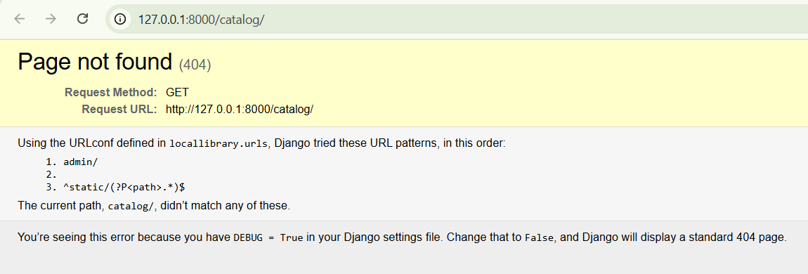

## Checklist tự review pull trước khi READY để trainer review

- ✅ Sử dụng thụt lề 2 spaces/4 spaces đồng nhất ở tất cả các files (đã cấu hình VSCode/Sublime)
- ✅ Cuối mỗi file kiểm tra có end line (file change không bị lỗi tròn đỏ ở cuối file)
- ✅ Mỗi dòng code không quá 80 ký tự (các dòng dài đã xuống dòng theo PEP8)
- ✅ Đã thêm .env, .pyc, __pycache__/… vào `.gitignore`

---

## WHAT
- Tạo project Django `locallibrary`
- Tạo ứng dụng `catalog` và đăng ký trong `INSTALLED_APPS`
- Cấu hình URL cho `catalog` và redirect từ `/` về `/catalog/`
- Tạo skeleton website chạy được

---

## WHY
- tutorial Part 2: Tạo skeleton website, cấu hình project và app ban đầu

---

## Evidence (Screenshot or Video)
- ảnh màn hình server chạy thành công tại `http://127.0.0.1:8000/`
    
---

## Notes (Kiến thức tìm hiểu thêm)
- PEP8 coding convention
- Django project vs app architecture
- URL dispatcher và include
